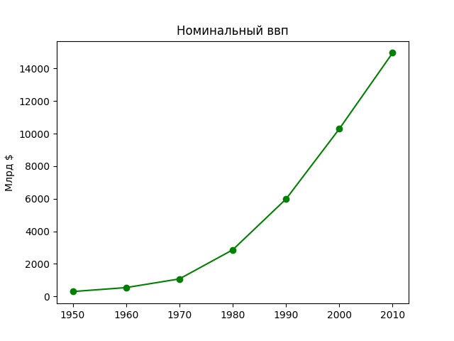

# Визуализация данных

**[Простой линейный график](https://github.com/Kolanar/DataScience/blob/281980d5894a4c80e5a6df550d0d973abe0b0d7c/Data%20visualization/mathlib.py#L8)**

**[Столбчатые графики](https://github.com/Kolanar/DataScience/blob/281980d5894a4c80e5a6df550d0d973abe0b0d7c/Data%20visualization/mathlib.py#L8)**

Столбчатые графики хорошо подходят для тех случаев, когда требуется показать варьируемость некоторой величины среди
некого дискретного множества элементов

Столбчатый график так же является хорошим вариантом для построения гистограмм сгруппированных числовых
значений с целью визуализации разведывания хар-ра распределения значений

**[Линейные графики](https://github.com/Kolanar/DataScience/blob/281980d5894a4c80e5a6df550d0d973abe0b0d7c/Data%20visualization/mathlib.py#L58)** 

Линейные графики хорошо подходят для изображения трендов

**[Диаграммы рассеяния](https://github.com/Kolanar/DataScience/blob/281980d5894a4c80e5a6df550d0d973abe0b0d7c/Data%20visualization/mathlib.py#L84)**

Диаграмма рассеяния лучше всего подходит для визуализации связи между двумя спаренными множествами данных.

На рисунке нижу показана связь между числом друзей пользователя и числом минут которые они проводят на веб-сайте каждый день

