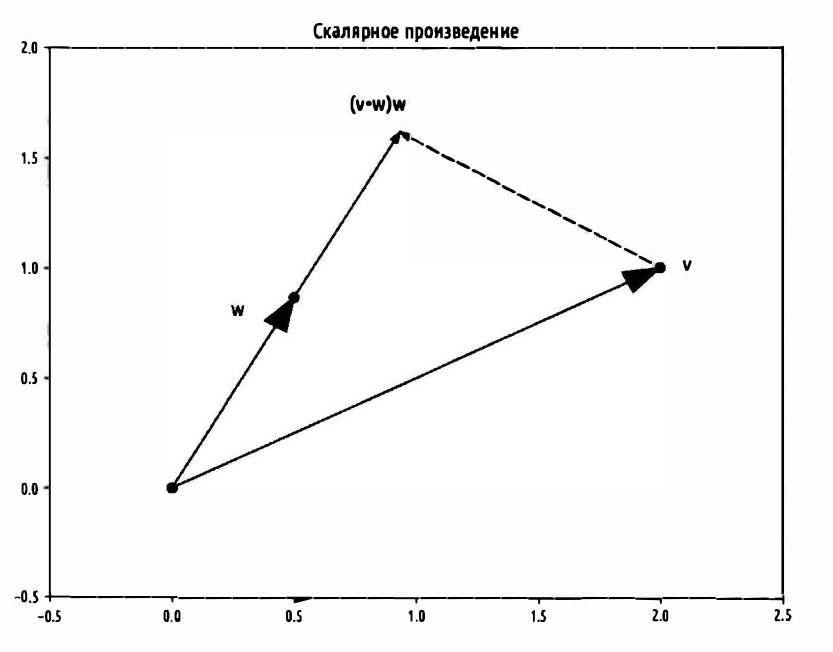
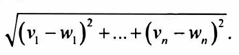

 
В абстрактном смысле векторы - это объекты которые можно складывать между собой, формируя новые векторы, и умножать их
на скалярные величины

Скалярная велечина - величина, каждое значение которой может быть выражено одним числом (длина, площадь, время и т.д)

**Действия с векторами:**
- **Сложение векторов** 

    Векторы складывают покомпонентно, т.е если два вектора V и W имеют одинаковую длину, то их сумма - это 
    вектор, чей первый элемент равен v[0] + w[0], второй - v[1] + w[1] и т.д (Если длины векторов разные, то операция 
    сложения не разрешена) 

- **Вычетание векторов**
    
    Схожим образом для получения *разности двух векторов* мы вычетаем соответствующие элементы

- **Покомпонентная сумма векторов**

    Вектор чей первый элемент равен сумме всех первых элементов, второй элемент - сумме всех вторых элементов и т.д

- **Умножение вектора на скаляр**

    Реализуется простым умножением каждого элемента вектора на это число 

- **Вычисление покомпонентных средних значений списка векторов (одинакового размера)**
 

- **Скалярное произведение**

  Скалярное произведение двух векторов есть сумма их покомпонентных произведений.

  Если вектор W имеет магнитуду равную 1, то скалярное произведение служит мерой того, насколько далеко 
  вектор  V простирается в направлении W. Например, если W = [1,0], тогда скалярное произведение
  dot(V,W) - это просто первый компонент вектора V. Выражаясь иначе, это длина вектора, которая получится,
  если спроецировать вектор V на вектор W 

- **Сумма квадратов**

- **Магнитуда (длина) вектора**

  - **Вычисление (Евклидова расстояния) между двумя векторами**

  Можно вычаслить по формуле

  

